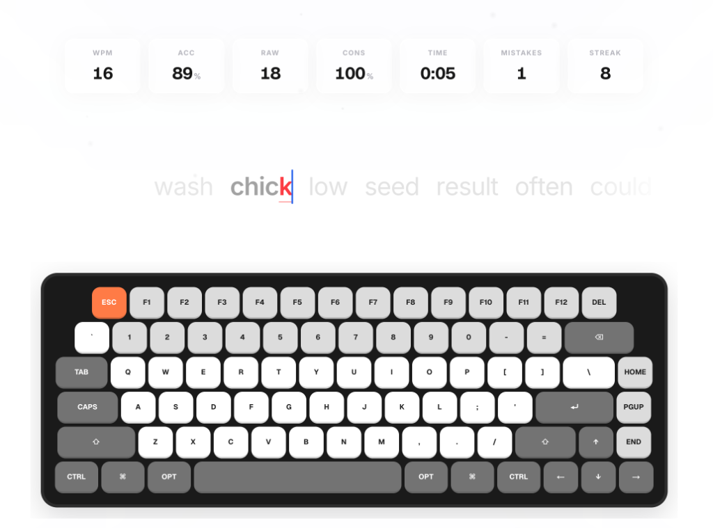

# thock. ⌨️

A premium, luxury typing visualizer and mechanical acoustic nodes customizer built with Next.js, React Three Fiber, and Web Audio API. Inspired by Apple, Linear, VisionOS, and Keeby.



---

## 🌟 Key Features

*   **Typewriter Horizontal Scroll:** Words flow in a single horizontal flex line. The active word stays in focus, and characters transition opacity dynamically, scrolling leftward with soft edge-gradient fades inspired by VisionOS.
*   **Keeby Visual Palette:** Defaults to a warm-light theme (`#f4f4f6`) with soft-orange/coral caret accents (`#ff7a45`) and typography settings (Inter, Geist Sans, or SF Pro).
*   **Dual Keyboard Visualizer Modes:**
    *   **2D Flat Layout:** A polished, face-on layout wrapped in a rounded chassis. Keys are grouped by type (White Alphas, Gray Modifiers, Light Gray Numbers, Orange Escape) and translate downward (`translate-y-[2px]`) on active keypress.
    *   **3D Model Visualizer:** Loads the photorealistic **Vortex Series GT-8 (NJ80)** GLB model. The case, knob, and plate are extracted, while custom independent 3D keycaps physically depress via Three.js spring equations.
*   **Low-Latency Web Audio API:** Spatialized keydown and keyup clicks. Automatically maps key positions to stereo pan nodes, and includes knobs for environment reverb, pitch core, master volume, and key stroke gain.
*   **Precise Stats Protection:** WPM, Raw WPM, Accuracy, mistakes, and consistency metrics are locked exactly at the millisecond the test finishes, preventing stats drift on the results card.
*   **Centered Preferences Modal:** A centered glass preferences menu with segmented selectors for layout (60% or 75%), fonts, sound nodes, and visual mode, toggled easily using the `Esc` key.

---

## 🚀 Getting Started

### 1. Install Dependencies
```bash
npm install
```

### 2. Audio Manifest Preparation
The application parses a master WAV file (Cherry Blue switches) and cuts keycaps slices automatically. Ensure you have `ffmpeg` installed on your system:
```bash
brew install ffmpeg
```
Then slice the audio tracks:
```bash
npm run prepare-sounds
```

### 3. Start Development Server
```bash
npm run dev
```
Open [http://localhost:3000](http://localhost:3000) in your browser.

---

## 🛠️ Tech Stack
*   **Framework:** Next.js 15 (React 19)
*   **3D Rendering:** React Three Fiber, Three.js, `@react-three/drei`
*   **Styling:** Tailwind CSS, Glassmorphism Filters
*   **State Management:** Zustand
*   **Audio Graph:** Web Audio API (Panner, Convolver, Gain, Pitch)
